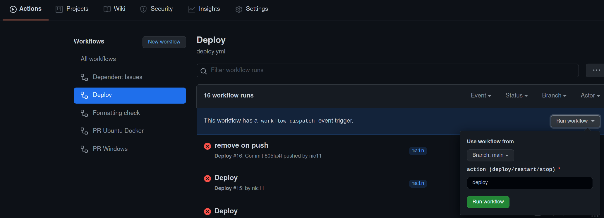

# Deploy Server from GitHub

A GitHub actions job is configured for deploying server from a git branch.
This guide shows how to set it up.

## GitHub prereqeusties

* You should own the repository you want to deploy from. Fork of our main repo
[skyrim-multiplayer/skymp](https://github.com/skyrim-multiplayer/skymp) should work.
* The following secrets should be set up in your repository settings
(https://github.com/skyrim-multiplayer/skymp/settings/secrets/actions in our case):
  * `DEPLOY_TARGET_HOST`: IP address or domain name of the server you want to deploy to.
  * `DEPLOY_SSH_PRIVATE_KEY`, `DEPLOY_SSH_KNOWN_HOSTS`: private key to access
    your server and its' expected ssh fingerprint. See below for details.
  * `DEPLOY_STATUS_WEBHOOK`: a Discord webhook. See https://support.discord.com/hc/en-us/articles/228383668-Intro-to-Webhooks for details. **Don't append anything like /github to it!**
* Add the branches you wish to deploy to [`.github/workflows/deploy.yml`](../.github/workflows/deploy.yml).
  Also change the desired target user (`DEPLOY_TARGET_USER`) to the one you've set up on your server.
* If you wish to deploy the branch from a pull request, you should open it from
  a branch located in **the main repository, not a fork**! \
  See https://docs.github.com/en/actions/security-guides/encrypted-secrets:
  > **Note**: With the exception of `GITHUB_TOKEN`, secrets are not passed
    to the runner when a workflow is triggered from a forked repository.


## Server prereqeusties

* Ubuntu 20.04 (other distros should also work, but not tested)
* Accessible from the Internet with open ports
* Docker installed and a user set up as a member of `docker` group. \
  **Note:** this effectively means root access, so be careful with users you
  let run deploy jobs (=users you give a write access to the repository).
* A directory `~/skymp-server-<branch>` should be set up for every branch you
  wish to deploy to this server. See 'setting up branch on a server' below. \
  _Note_: currently, only `indev` branch is hardcoded.

### Setup access for GitHub

Get server's public key:
```
ssh-keyscan <server ip>
<...>
# <server ip>:22 SSH-2.0-OpenSSH_8.2p1 Ubuntu-4ubuntu0.2
<server ip> ecdsa-sha2-nistp256 AAAAE<...>
<...>
```

Copy that string with `ecdsa-sha2-nistp256` to the `DEPLOY_SSH_KNOWN_HOSTS` secret.

Generate a key pair for deployment and add it as an authorized key:
```sh
ssh-keygen -b 4096 -C skymp_github_deployer -f gh_key
cat gh_key.pub >> ~/.ssh/authorized_keys
```

Copy contents of `gh_key` (no `.pub`) to the `DEPLOY_SSH_PRIVATE_KEY` secret.

For safety, you can also delete the private key:
```
rm gh_key
```

## Setting up branch on a server

* Create a directory like this: `mkdir -p ~/skymp-server-<branch>/server/data`
  and upload the data files required by your server.
* Create `server-settings.json` with your desired settings in `skymp-server-<branch>`
  (not in `skymp-server-<branch>/server`, that would be overwritten).

Expected contents of server branch required for the deployment process to succeed:
```
$ ls -lhR skymp-server-<branch>/
skymp-server-<branch>/:
total 8.0K
drwxrwxr-x 3 ubuntu ubuntu 4.0K Dec  5 12:04 server
-rw-rw-r-- 1 ubuntu ubuntu  239 Dec  5 12:02 server-settings.json

skymp-server-<branch>/server:
total 4.0K
drwxrwxr-x 2 ubuntu ubuntu 4.0K Dec  5 12:01 data

skymp-server-<branch>/server/data:
total 346M
-rw-rw-r-- 1 ubuntu ubuntu  25M Dec  5 12:01 Dawnguard.esm
-rw-rw-r-- 1 ubuntu ubuntu  62M Dec  5 12:01 Dragonborn.esm
-rw-rw-r-- 1 ubuntu ubuntu 3.8M Dec  5 12:01 HearthFires.esm
-rw-rw-r-- 1 ubuntu ubuntu 239M Dec  5 12:01 Skyrim.esm
-rw-rw-r-- 1 ubuntu ubuntu  18M Dec  5 12:01 Update.esm
```

## Running deploy

Deploy action is set up as a separate workflow
[`.github/workflows/deploy.yml`](../.github/workflows/deploy.yml)
and can be triggered in [actions](https://github.com/skyrim-multiplayer/skymp/actions)
tab in the repository header on GitHub:
https://github.com/skyrim-multiplayer/skymp/actions/workflows/deploy.yml



Progress can be tracked by following the link in run list or in the Discord
channel `DEPLOY_WEBHOOK` is attached to.

Several actions are available:
* `deploy` - merge all PRs with `merge-to:<branch>` label set, build the resulting
  source, upload build artifacts to the server and restart it
* `restart` - just restart the server (stop if it is running and start)
* `stop` - just stop the server
